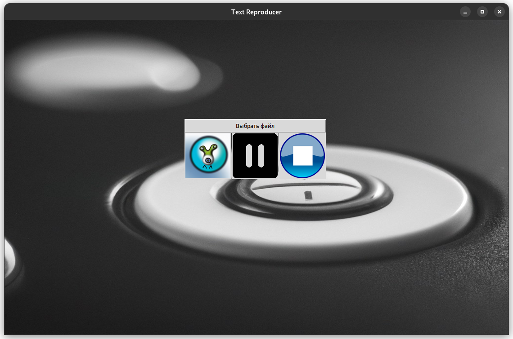

# Text Reproducer
_The goal is to help people who can't or don't want to read_

___

## Начало Работы
* ### Клонируйте
      git clone git@github.com:fallra1n/text-reproducer.git
* ### Установка зависимостей
      (P.S)Только один(в первый) раз!
      chmod +x req_install.sh

      ./req_install.sh
  (P.S) не хотел писать "pip install req...", так как это не сработает из-за спецефичных пакетов, для начала нужно поставить различные библиотеки на машину типо libspeak1(если это убунту) или espeak(для arch), поэтому в будущем это скрипт будет изменен! 
* ### Запуск
      (P.S)Только один(в первый) раз!
      chmod +x run_app.sh

      ./run_app.sh
* ### Урааа, мы открылись!

---

## Теперь про функционал и инструменты
  * #### Для воспроизведения текста используется библиотека [_pyttsx3_](https://pypi.org/project/pyttsx3/).
  * #### Для графики используется библиотека [_tkinter_](https://metanit.com/python/tkinter/).
  ### После запуска приоложения у нас запускается окошко:
  
  * #### Итак, мы можем выбрать файл для воспроизведения нажав кнопку _'Выбрать файл'_.
  * #### Самая левая кнопка запускает текущий выбранный файл или продолжает воспроизведение, если мы ранее нажали на 2-ю кнопку(кнопку паузы).
  * #### Кнопка по середине ставит текущее воспроизведение на паузу.
  * #### Самая правая кнопка прерывает текущее воспроизведение.
  * #### [Дисклеймер №1] Если вы нажимаете кнопку выбрать файл, то вы объязательно должны выбрать его, а не нажать _'cancel'_, т.е продолжить слушать текущий файл не получится, если вы поставили его на паузу, а потом в холостую выбрали файл.
  * #### [Дисклеймер №2] Приложение работает по наивному алгоритму, поэтому лучше закидывайте в него реальные файлы, т.е где есть пробелы, а не бесконечное количество одного символа, иначе будут проблемы с остановкой и паузой воспроизведения.

---

## Теперь про внутренную реализацию
  * #### Кнопка выбрать файл функционирует средствами [Tkinter'a](https://docs.python.org/3/library/dialog.html).
  * #### Итак, воспроизведение каждого файла происходит в отдельном треде, этот тред создается и запускается в функции play_text в файле [app-gui/app/widgets_handlers.py](app-gui/app/widgets_handlers.py):
        t = threading.Thread(target=Run, args=(last_file_path, paused_cv))
        t.start()
  * #### Для того, чтобы поставить воспроизведение на паузу мы используем _'Условное выражение'_ или _'condvar'_.
    #### --- Но зачем кондвар, если мы можем это делать с помощью булевых флажков.
    #### А затем, чтобы не блокировать ядро операционной системы, постоянно крутясь на этом булевом флажке, у нас конечно же будет булевый флажок, но когда этот флаг будет истиным, то мы просто уснем, пока нас не разбудят([code](back/session.py)):
          if is_paused:
              with paused_cv:
                  paused_cv.wait()
    #### А будить мы будем в той же функции play_text ([code](app-gui/app/widgets_handlers.py)):
        if back.session.is_paused:
            back.session.is_running = False
            back.session.mutex.acquire()
            with paused_cv:
                paused_cv.notify_all()
    * #### Конечно же нам нужны булевый флажки и мьютекс:
    * #### is_running - для отслеживания нажатия пользователем кнопки _stop_  
    * #### is_paused - для отслеживания нажатия пользователем кнопки _pause_
    * #### Мьютекс нужен же в том случае, когда мы поставили на паузу текущее воспроизведение, а потом выбрали новый файл для воспроизведения, в этом случае нам сначала нужно остановить предыдущий поток, если мы это не будем контролировать с помощью мьютекса, то эти 2 потока будут конкурировать между собой и будет _data race_, на этих булевых флажках ([code](app-gui/app/widgets_handlers.py)):
          if is_new_file:
              if back.session.is_paused:
                  ...
                  back.session.mutex.acquire() <- берем мьютекс перед остановкой старого потока
                  with paused_cv:
                      paused_cv.notify_all() <- ждущий поток отпустит мьютекс и уничтожится

              back.session.mutex.acquire() <- снова берем мьютекс или блокируемся пока старый поток не остановится
              ... (start new thread)
              back.session.mutex.release() <- отпускаем мьютекс
    * #### Флаги _is_running_, _is_paused_, _mutex_ хранится в файле [back/session](back/session.py) как глобальные переменные, _condvar_ можно было бы хранить также, но я решил хранить его как поле класса _App_.
  * #### Для остановки воспроизведения мы просто меняем состояние булевого флага и запущенный обработчик(поток) завершится. Дело в том что у нас идет воспроизведение по словам, и обработчик на каждом слове проверяет валидность флажка, поэтому если закинуть файл с бесконечным количеством одной букв без пробела, то остановить или поставить на паузу не получится([code](back/session.py))(Пока ничего лучше я не придумал):
        for word in words:
            if is_paused:
                ...

            if not is_running:
                ...    
## Теперь про структуру
     <project>
      |-- app-gui
          |-- app
               app.py
               widgets_handlers.py 
          main.py
      |-- back
           text_reproducer.py
           session.py
      README <- мы тут
  * #### В [app.py](app-gui/app/app.py) объявлен класс App, который реализует графику и кнопки с помощью _tkinter'а_ в своих методах.
  * #### В [main.py](app-gui/main.py) создается экземпляр класса _App_ после вызывается метод _Run_, в котором все инициализируется и запускается окошко.
  * #### К каждой кнопке подвешивается свой хэндлер, все хэндлеры и вспомогательные функции объявлены в файле [widgets_handlers.py](app-gui/app/widgets_handlers.py).  
  * #### В файле [back/session.py](back/session.py) реализуется класс _Session_, который в своем методе воспроизводит переданный файл с помощью библиотеки [pyttsx3](https://pypi.org/project/pyttsx3/).
  * #### В обработчике кнопки старт создается тред, в который для исполнения передается функция _Run_ из файла [back/text_reproducer.py](back/text_reproducer.py) в котором создается обеъкт класса [_Session_](back/session.py) и вызывается метод _Run_.