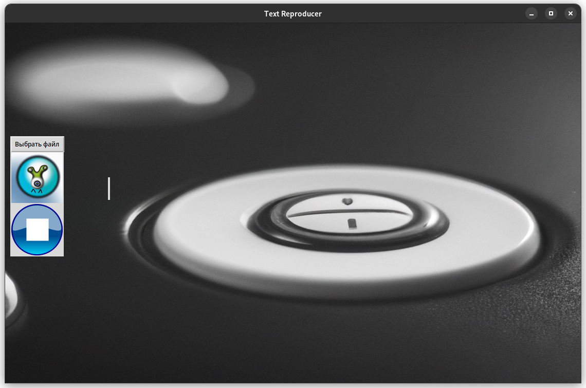

# Text Reproducer
_The goal is to help people who can't or don't want to read_

___

## Начало Работы
* ### Клонируйте
      git clone git@github.com:fallra1n/text-reproducer.git
* ### Установка зависимостей
      (P.S)Только один(в первый) раз!
      chmod +x req_install.sh

      ./req_install.sh
  (P.S) не хотел писать "pip install req...", так как это не сработает из-за спецефичных пакетов, для начала нужно поставить различные библиотеки на машину типо libspeak1(если это убунту) или espeak(для arch), поэтому в будущем это скрипт будет изменен! 
* ### Запуск тестов
      (P.S)Только один(в первый) раз!
      chmod +x run_test.sh

      ./run_test.sh

* ### Запуск приложения
      (P.S)Только один(в первый) раз!
      chmod +x run_app.sh

      ./run_app.sh
* ### Урааа, мы открылись!

---

## Теперь про функционал и инструменты
  * #### Для воспроизведения текста используется библиотека [_pyttsx3_](https://pypi.org/project/pyttsx3/).
  * #### Для графики используется библиотека [_tkinter_](https://metanit.com/python/tkinter/).
  ### После запуска приоложения у нас запускается окошко:
  
  * #### Итак, мы можем выбрать файл для воспроизведения нажав кнопку _'Выбрать файл'_.
  * #### Кнопка по середине запускает текущий файл и при воспроизведении сменяется на кнопку паузы(и наоборот).
  * #### Нижняя кнопка прерывает текущее воспроизведение.
  * #### [Дисклеймер №1] Если вы нажимаете кнопку выбрать файл, то вы объязательно должны выбрать его, а не нажать _'cancel'_, т.е продолжить слушать текущий файл не получится, если вы поставили его на паузу, а потом в холостую выбрали файл.
  
---

## Теперь про внутренную реализацию
  * #### Кнопка выбрать файл функционирует средствами [Tkinter'a](https://docs.python.org/3/library/dialog.html).
  * #### Итак, воспроизведение каждого файла происходит в отдельном процессе, этот процесс создается и запускается в функции play_text в файле [src/app/widgets_handlers.py](src/app/widgets_handlers.py):
        new_process = multiprocessing.Process(target=run, args=(last_file_path, ))
        new_process.start()
  * #### Для того, чтобы поставить воспроизведение на паузу мы используем сигнал _'SIGSTOP'_.
        if last_process_pid != -1:
            os.kill(last_process_pid, signal.SIGSTOP)
    #### А будить мы будем c помощью сигнала _'SIGCONT'_ ([code](src/app/widgets_handlers.py)):
        elif last_process_pid != -1:
            os.kill(last_process_pid, signal.SIGCONT)
  * #### Для остановки воспроизведения мы используем сигнал _'SIGKILL'_(просто убиваю запущенный процесс):
        if last_process_pid != -1:
            os.kill(last_process_pid, signal.SIGKILL)
## Теперь про структуру
     <project>
      |-- src
      |   |-- app
      |   |   |-- app.py
      |   |   |-- widgets_handlers.py
      |   |
      |   |-- back
      |   |   |-- text_reproducer.py
      |   |   |-- session.py
      |   |
      |   |-- main.py
      |
      |-- tests
      |   |-- test_paths.py
      |
      |-- README <- мы тут

  * #### В [app.py](src/app/app.py) объявлен класс App, который реализует графику и кнопки с помощью _tkinter'а_ в своих методах.
  * #### В [main.py](src/main.py) создается экземпляр класса _App_ после вызывается метод _Run_, в котором все инициализируется и запускается окошко.
  * #### К каждой кнопке подвешивается свой хэндлер, все хэндлеры и вспомогательные функции объявлены в файле [widgets_handlers.py](src/app/widgets_handlers.py).  
  * #### В файле [back/session.py](src/back/session.py) реализуется класс _Session_, который в своем методе воспроизводит переданный файл с помощью библиотеки [pyttsx3](https://pypi.org/project/pyttsx3/).
  * #### В обработчике кнопки старт создается процесс, в который для исполнения передается функция _Run_ из файла [back/text_reproducer.py](src/back/text_reproducer.py) в котором создается обеъкт класса [_Session_](src/back/session.py) и вызывается метод _Run_.